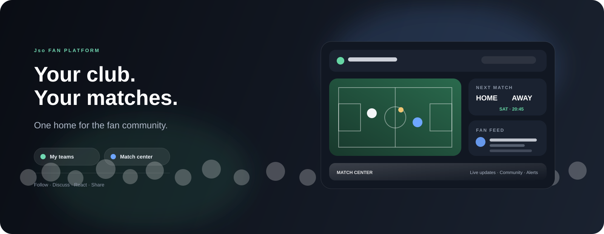

# Jso-Web — Fan Platform

<p align="center">
  
</p>

<p align="center">
  <strong>Una piattaforma digitale per tifosi, squadre, partite e community.</strong>
</p>

Jso-Web è il frontend di una piattaforma pensata per riunire in un'unica esperienza tutto ciò che interessa a un tifoso: squadre preferite, partite, aggiornamenti, contenuti e interazione con la community.

## Visione

Creare uno spazio dove il tifoso possa entrare, scegliere i propri club e vivere una home personalizzata con il meglio dell'esperienza sportiva e sociale.

### Esperienza principale

```text
Choose your teams
      ↓
Personalized Home
      ↓
Matches + Updates + Community
      ↓
Engage / Comment / React / Follow
      ↓
Build your fan profile
```

## Core Features

| Area | Obiettivo |
|---|---|
| **My Teams** | Seguire uno o più club e personalizzare il feed |
| **Match Center** | Consultare partite, stato, eventi e risultati |
| **Fan Feed** | Leggere e pubblicare contenuti della community |
| **Fan Profile** | Identità, club preferiti e attività del tifoso |
| **Notifications** | Ricevere aggiornamenti sui team e sulle partite |
| **Community** | Commenti, reaction, discussioni e contenuti social |

## MVP

Il primo MVP è orientato a quattro percorsi principali:

1. Registrazione e profilo tifoso.
2. Selezione delle squadre preferite.
3. Home personalizzata con match center e feed.
4. Interazione con la community tramite post, commenti e reaction.

## Frontend Stack

- React 18
- Vite 6
- JavaScript / JSX
- CSS responsive
- Oxlint

## Target Architecture

```text
React + Vite
    ↓
Feature-based Frontend
    ↓
ASP.NET Core .NET 10 API
    ↓
Application / Domain / Infrastructure
    ↓
SQL Server
    ↓
Sports Data Providers / Notifications / Media
```

Il frontend deve rimanere indipendente dai provider dati: partite, classifiche, news e notifiche saranno esposti tramite API applicative.

## Repository Structure

```text
src/
  app/
  components/
  features/
  pages/
  services/
  hooks/
  utils/
  assets/

docs/
  ANALYSIS.md
  BUSINESS_ANALYSIS.md
  USER_STORIES.md
  TECHNICAL_BACKLOG.md
  DOMAIN_MODEL.md
  ROADMAP.md
```

## Documentation

- [Technical Analysis](docs/ANALYSIS.md)
- [Business & Functional Analysis](docs/BUSINESS_ANALYSIS.md)
- [User Stories](docs/USER_STORIES.md)
- [Technical Backlog](docs/TECHNICAL_BACKLOG.md)
- [Domain Model](docs/DOMAIN_MODEL.md)
- [Roadmap](docs/ROADMAP.md)

## Local Development

```bash
npm install
npm run dev
```

Build di produzione:

```bash
npm run build
```

Lint:

```bash
npm run lint
```

## Product Principles

- Mobile-first e responsive.
- UX semplice per il tifoso.
- Personalizzazione basata sui club seguiti.
- Dati sportivi separati dalla UI.
- Community moderabile e sicura.
- API key e segreti esclusivamente lato backend.

## Roadmap sintetica

**Phase 1** — Frontend foundation + navigation + team selection

**Phase 2** — Match Center + live events

**Phase 3** — Fan Feed + comments + reactions

**Phase 4** — Profiles + notifications + personalization

**Phase 5** — Backend .NET 10 + SQL Server + sports data integration

**Phase 6** — Moderation, analytics, performance and production hardening

## Status

🚧 **In development — MVP**

Il repository è in fase di trasformazione da starter Vite/React a piattaforma fan-oriented.
