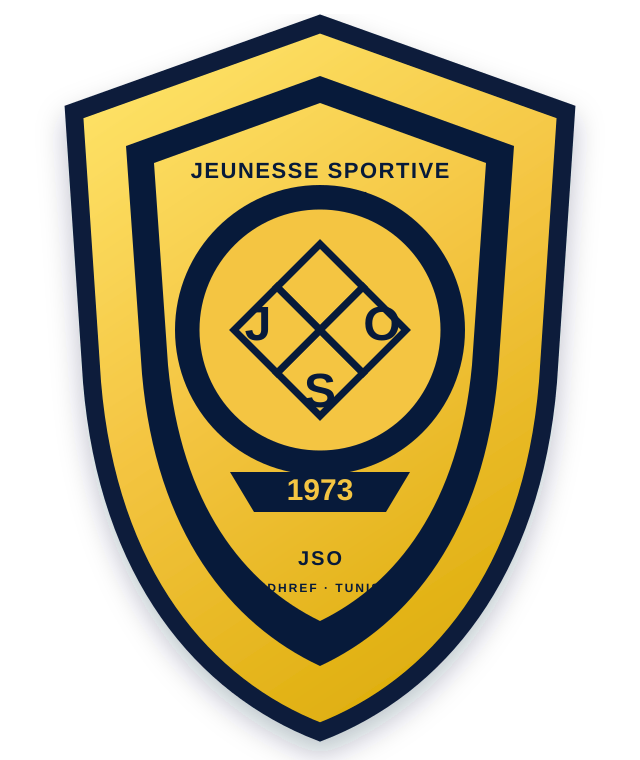

# JSO — Jeunesse Sportive d'Oudhref

<p align="center">
  
</p>

<p align="center">
  <strong>Official digital club experience</strong><br />
  Match Center · Team · News · Media · Community · Shop · Admin
</p>

JSO-Web è il nuovo sito digitale di **JSO — Jeunesse Sportive d'Oudhref**.

Il progetto non nasce come semplice fan page: l'obiettivo è costruire una piattaforma web moderna per il club, con una forte identità visiva e una base tecnica pronta a crescere verso live match, dati sportivi, media, community, e-commerce e gestione completa tramite back office.

## Product Vision

```text
CLUB IDENTITY
      ↓
TEAM + MATCH CENTER
      ↓
NEWS + MEDIA HOUSE
      ↓
FANS + COMMUNITY
      ↓
SHOP + MEMBERSHIP
      ↓
CLUB ADMIN / CMS
```

## Public Website

### Home
Hero editoriale, prossima partita, ultimi risultati, news, media, community, shop e CTA membership.

### Club
Storia, valori, identità, stadio, contatti, sponsor e informazioni istituzionali.

### Team
Rosa, giocatori, staff, numeri di maglia e profili.

### Match Center
Calendario, risultati, classifiche, stato live, eventi, statistiche e area matchday.

### Newsroom
News, comunicati, interviste, articoli e contenuti editoriali.

### Media House
Video, highlights, foto, gallery e archivio storico.

### Fans & Community
Profili, post, commenti, reaction, notifiche e conversazioni legate al club.

### Club Shop
Maillots, accessori, merchandising e ordini in una fase successiva.

### Membership
Area supporter/premium con contenuti esclusivi, vantaggi e iniziative future.

## Admin / Back Office

Il club deve poter gestire il sito senza modificare il codice.

Il back office comprenderà:

- Dashboard operativa.
- RBAC e ruoli admin.
- Club settings.
- Team e player management.
- Match management.
- Sports data sync.
- News CMS.
- Media library.
- Homepage builder.
- Community moderation.
- User management.
- Shop management.
- Analytics.
- Integrations health.
- Audit logs.

Documentazione: [Admin Panel Specification](docs/ADMIN_PANEL.md)

## Visual Direction

Il linguaggio visivo è **premium sports + modern digital**:

- deep navy come base;
- JSO gold come identità;
- electric blue per interazioni;
- cyan solo come tech/live accent;
- glassmorphism;
- card multilivello e blur;
- glow controllati;
- typography `Manrope + Inter`;
- fotografie cinematografiche di matchday/stadio/tifosi;
- micro-animazioni e responsive layout.

Vedi [Design System](docs/DESIGN_SYSTEM.md).

## Tech Stack

- React 18
- Vite 6
- JavaScript / JSX
- CSS moderno responsive
- ASP.NET Core .NET 10 (target backend)
- SQL Server (target database)
- Docker
- Sports data provider abstraction
- Media storage
- CI/CD con GitHub Actions

## Architecture

```text
                    PUBLIC WEB
                 React + Vite
                       │
                       ▼
               ASP.NET Core .NET 10
              ┌────────┼─────────┐
              ▼        ▼         ▼
           Domain   CMS/Admin   Integrations
              │        │         │
              └────────┼─────────┘
                       ▼
                   SQL Server
                       │
       ┌───────────────┼────────────────┐
       ▼               ▼                ▼
 Sports Provider   Media Storage    Analytics
```

## Repository Structure

```text
src/
  app/
  components/
  features/
  pages/
  services/
  hooks/
  utils/
  assets/

docs/
  ANALYSIS.md
  BUSINESS_ANALYSIS.md
  USER_STORIES.md
  TECHNICAL_BACKLOG.md
  DOMAIN_MODEL.md
  ROADMAP.md
  ADMIN_PANEL.md
  DESIGN_SYSTEM.md
```

## Documentation

- [Technical Analysis](docs/ANALYSIS.md)
- [Business & Functional Analysis](docs/BUSINESS_ANALYSIS.md)
- [User Stories & Acceptance Criteria](docs/USER_STORIES.md)
- [Technical Backlog](docs/TECHNICAL_BACKLOG.md)
- [Domain Model](docs/DOMAIN_MODEL.md)
- [Admin Panel](docs/ADMIN_PANEL.md)
- [Design System](docs/DESIGN_SYSTEM.md)
- [Roadmap](docs/ROADMAP.md)

## Local Development

```bash
npm install
npm run dev
```

Production build:

```bash
npm run build
```

Lint:

```bash
npm run lint
```

## Product Principles

- Official club identity first.
- Mobile-first and responsive.
- Data-driven Match Center.
- Content managed from Admin.
- Strong accessibility and performance baseline.
- No provider secrets in the frontend.
- RBAC enforced by backend.
- Auditability for critical admin operations.

## Delivery

### Phase 1 — Visual Foundation
Premium JSO design system, homepage, navigation, responsive UI and reusable components.

### Phase 2 — Club Core
Club, team, players and content model.

### Phase 3 — Match Center
Fixtures, results, match detail, live events and provider integration.

### Phase 4 — CMS + Admin
Admin dashboard, RBAC, news CMS, media library and homepage builder.

### Phase 5 — Community
Profiles, feed, posts, comments, reactions, notifications and moderation.

### Phase 6 — Commerce & Growth
Shop, membership, sponsor modules, analytics and growth tools.

## Status

🚧 **In development** — the repository is being transformed into the official JSO digital club platform.
