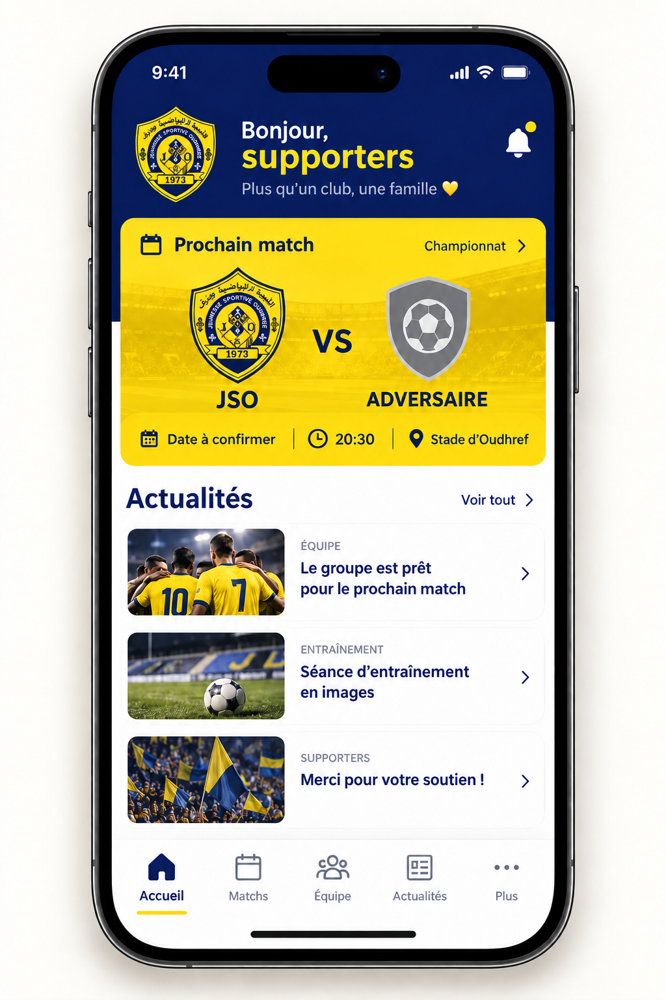
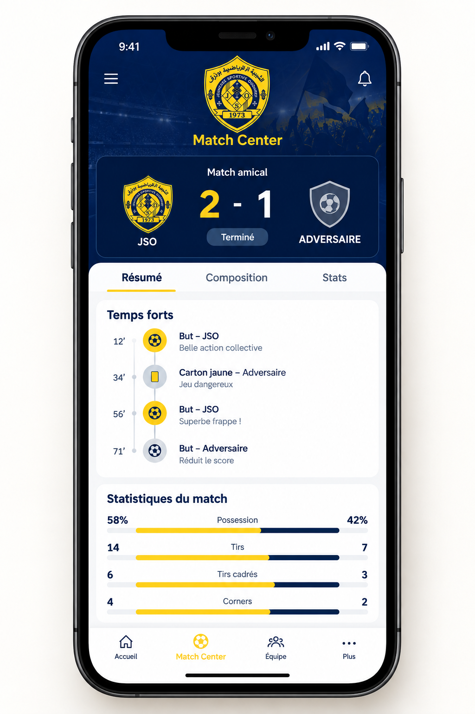

<div align="center">


# JSO — Jeunesse Sportive de Oudhref

### La maison digitale du club

Plateforme web moderne pour **Jeunesse Sportive de Oudhref**, conçue pour réunir supporters, joueurs, staff et administration autour d'une expérience digitale unique.

<p>
  
  
  
  
  
</p>

</div>

---

## ✨ Vision

JSO Web non è solo un sito vetrina: è una **digital platform del club**.

L'obiettivo è creare un ecosistema unico per:

- 🏟️ seguire partite, risultati e Match Center
- 📰 pubblicare notizie e contenuti editoriali
- 📸 gestire foto e media del club
- 👥 presentare squadre, giocatori e staff
- 🧑‍💻 amministrare il sito tramite back-office
- 📊 raccogliere analytics e audit
- 🤝 gestire sponsor e partnership
- 💬 costruire una community di tifosi
- 🛍️ preparare una futura area shop
- 📱 estendere successivamente l'esperienza a iOS e Android

## 📍 Stato dell'attività — 26 settembre 2026

**Fase attuale: preparazione dell'MVP web per la produzione.** Il sito e il backend sono nel repository; un deploy pubblico sul dominio reale non risulta ancora verificato.

| Area | Raggiunto e verificato | Ancora da completare |
|---|---|---|
| Sito e admin | Logo JSO, interfaccia responsive e concept Flutter; frontend e pannello admin usano `/api`. Build (Vite) e lint (oxlint) passano in CI e in locale. Quando l'API risponde ma non ci sono articoli, il sito mostra uno stato vuoto/errore invece di notizie dimostrative. | Verificare URL API, CORS e HTTPS sul dominio reale; collaudare i flussi completi nel browser. |
| Backend e dati | API .NET 10, migration PostgreSQL 17 applicata in CI, primo admin creato da credenziali d'ambiente e login verificato. La CI ora esegue il percorso critico stagione → competizione → squadra → partita → API pubblica → sito, verifica che le rotte admin rifiutino le chiamate anonime (401), verifica pubblicazione/lettura notizie, upload e lettura media, e il rifiuto di un file camuffato da PNG (400). Gli endpoint admin per creare stagioni e competizioni sono autorizzati e validati. | Ripetere avvio e migration sull'ambiente Oracle; eseguire un backup reale e provare il ripristino di database e media. |
| Infrastruttura | Docker Compose production predisposto con attesa di PostgreSQL pronto; Nginx accetta il limite upload dell'API. Build Docker di frontend e backend ARM64 e controllo Nginx riusciti in CI. Script di backup, verifica, retention (dry-run di default) e procedura di restore disponibili in [deploy/oracle](deploy/oracle/README.md); tutti gli script superano il controllo di sintassi in CI. Script di collaudo `check-config.sh`, `check-local.sh` e `check-domain.sh` pronti. | Preparare VM Oracle, dominio, certificato HTTPS, backup automatico con copia esterna e monitoraggio; eseguire il deploy reale. |
| App mobile | Due immagini concept nel README; Flutter è la scelta tecnica. | Creare l'app Android/iOS e collegarla alle API. |

### Cosa manca per andare in produzione

Il lavoro verificabile del [piano agenti](docs/AGENT_EXECUTION_PLAN.md) (A1–A5) è completato e integrato. Gli elementi rimasti richiedono la VM Oracle reale e vanno eseguiti in quest'ordine sull'ambiente reale:

1. **VM e deploy** — provisioning della VM Oracle Ampere A1, `.env.prod` compilato, `deploy/oracle/deploy.sh` e controllo `/health`.
2. **DNS e HTTPS** — record DNS del dominio JSO verso la VM, TLS via Cloudflare o reverse proxy, poi `deploy/oracle/check-domain.sh https://dominio-reale`.
3. **Backup reale** — primo `deploy/oracle/backup.sh` con copia off-VM e pianificazione cron (backup giornaliero, verifica settimanale).
4. **Prova di ripristino** — restore di database e media su uno stack di recovery separato; solo dopo il controllo umano si registra il marcatore `RESTORE_TESTED`, che abilita la retention `prune-backups.sh`.
5. **Collaudo end-to-end** — flussi completi nel browser (login admin, upload, CORS) sul dominio reale e monitoraggio.

Verifiche: [CI frontend, backend e PostgreSQL con flussi notizie/media](https://github.com/abderrazak-naceur/Jso-Web/actions/runs/36239006026) · [build Docker frontend/backend ARM64 e controllo Nginx](https://github.com/abderrazak-naceur/Jso-Web/actions/runs/36239006058). La priorità operativa e i criteri di uscita sono nel [piano aggiornato](docs/ROADMAP.md).

## 🧭 Cosa manca da sviluppare

Questa sezione riflette lo **stato reale del codice** (non solo i piani), aggiornata al 26 settembre 2026. Legenda: ✅ fatto · 🟡 parziale · ⛔ da fare.

### Riepilogo per feature

| Feature | Backend (API) | Frontend (UI) | Stato | Cosa manca |
|---|---|---|---|---|
| Sito pubblico + Match Center + News + Media + Squadra | ✅ | ✅ | ✅ | Collaudo dati reali end-to-end sul dominio |
| Admin: club, squadra/giocatori, partite, eventi, news, media, contenuti, sicurezza/audit | ✅ | ✅ | ✅ | — |
| Admin: stagioni e competizioni (CRUD) | ✅ | 🟡 | 🟡 | Modulo UI dedicato (oggi gestite via API/CI) |
| Sponsor (gestione + vetrina pubblica) | ✅ | ✅ | ✅ | Report esposizione (impression/clic) |
| Analytics giocatore/squadra (derivate da eventi/formazioni) | ✅ | ✅ | ✅ | `PlayerMatchStat` dedicato (minuti, assist, rating) |
| Account tifosi (registrazione/login/profilo) | ✅ | ✅ | 🟡 | Sessione cookie HttpOnly, verifica email, reset password |
| Partita online a pagamento (paywall + YouTube) | ⛔ | ⛔ | ⛔ | Provider pagamenti, `MatchAccessProduct/Purchase`, webhook firmato, endpoint `watch`, player |
| Finanze del club (entrate/uscite, "soldi persi") | ⛔ | ⛔ | ⛔ | Intera area (vedi piano dedicato) |
| Homepage Builder + Menu/Footer editabili | ⛔ | ⛔ | ⛔ | Intera area |
| Shop / Merchandising | ⛔ | ⛔ | ⛔ | Intera area + pagamenti |
| Biglietteria & eventi | ⛔ | ⛔ | ⛔ | Intera area |
| Membership / abbonamenti tifosi | ⛔ | ⛔ | ⛔ | Intera area |
| Community & moderazione | ⛔ | ⛔ | ⛔ | Intera area |
| Notifiche & messaging (push/email) | ⛔ | ⛔ | ⛔ | Provider (FCM/email) + preferenze |
| App mobile Flutter (iOS/Android) | ⛔ | ⛔ | ⛔ | Intero progetto app |
| Deploy produzione (VM Oracle, DNS/HTTPS, backup provato) | 🟡 | — | 🟡 | Vedi "Cosa manca per andare in produzione" sopra |

### Prossimi passi consigliati (in ordine)

1. **Andare in produzione** (Orizzonte 0): deploy VM Oracle, DNS/HTTPS, backup reale + prova di restore, collaudo browser. È il prerequisito di tutto il resto.
2. **Completare gli account tifosi** (🟡→✅): passare alla sessione cookie HttpOnly, aggiungere verifica email e reset password.
3. **Partita online a pagamento**: paywall con provider di pagamento + YouTube unlisted dietro accesso pagato — richiede prima la scelta del gateway. Dettagli in [FAN_ACCOUNTS_PLAN](docs/FAN_ACCOUNTS_PLAN.md).
4. **Homepage Builder / Menu-Footer**: il club compone la home senza toccare il codice.
5. **Finanze del club** e **estensione gestione squadra** — vedi [ADMIN_SQUAD_FINANCE_ANALYTICS_PLAN](docs/ADMIN_SQUAD_FINANCE_ANALYTICS_PLAN.md).
6. **Shop, biglietteria, membership, notifiche, community** e **app Flutter** — Orizzonti 2–3 della [visione 2030](docs/PLATFORM_VISION_2030.md).

Piani di dettaglio: [visione pluriennale 2030](docs/PLATFORM_VISION_2030.md) · [account tifosi + streaming a pagamento](docs/FAN_ACCOUNTS_PLAN.md) · [squadra/finanze/analytics](docs/ADMIN_SQUAD_FINANCE_ANALYTICS_PLAN.md) · [roadmap operativa](docs/ROADMAP.md).

## 🖼️ Platform Preview

<div align="center">


</div>

---

## 🧩 Architecture

```text
┌──────────────────────────────────────────────────────────────┐
│                         JSO WEB                              │
├──────────────────────────────────────────────────────────────┤
│  React + Vite + Tailwind                                    │
│  Public Website + Admin Back Office                         │
└─────────────────────────────┬────────────────────────────────┘
                              │ REST / JSON
┌─────────────────────────────▼────────────────────────────────┐
│                     ASP.NET Core .NET 10                     │
│                                                              │
│  API · Auth · RBAC · Match Center · News · Media · Audit    │
└─────────────────────────────┬────────────────────────────────┘
                              │ EF Core
┌─────────────────────────────▼────────────────────────────────┐
│                    PostgreSQL / SQL Server                    │
└──────────────────────────────────────────────────────────────┘

Production target
      Oracle Cloud Always Free
              │
              ├── Docker API
              ├── PostgreSQL
              ├── Nginx
              └── Persistent media volume
```

---

## 📱 Anteprima app mobile Flutter

<div align="center">




<br />

**Home · Match Center**

</div>

Queste immagini sono **concept visivi** della futura app Flutter per iOS e Android. Mostrano la direzione grafica; i contenuti e i risultati rappresentati sono illustrativi. L'app non è ancora pubblicata.

Il sito usa il nuovo stemma JSO in `public/JSO-crest-regenerated.png`; gli asset visivi sono nel dossier `public/`.

---

## 🛠️ Technology Stack

### Frontend

- React 18
- Vite 6
- Tailwind CSS 4
- Lucide React
- Responsive mobile-first UI
- Public website + Admin SPA

### Backend

- ASP.NET Core .NET 10
- C#
- Entity Framework Core 10
- REST API
- JWT Authentication
- Role-Based Access Control
- Rate limiting
- Health checks
- Audit logging
- Swagger / OpenAPI

### Data

- PostgreSQL 17 for Oracle ARM64 production
- SQL Server supported for local development
- EF Core provider abstraction
- Initial PostgreSQL migration versioned and applied to PostgreSQL 17 in CI; Oracle deployment verification pending

### Infrastructure

- Docker
- Docker Compose
- Nginx
- Oracle Cloud Always Free target
- Persistent PostgreSQL volume
- Persistent media volume

---

## 🚀 Current Features

Le caselle completate indicano funzioni presenti nel codice; la verifica end-to-end su dominio reale è ancora nella roadmap.

### Public Website

- [x] Responsive homepage
- [x] Club information
- [x] Match Center
- [x] Match details
- [x] Match events
- [x] Lineups
- [x] Officials
- [x] Match statistics
- [x] Newsroom
- [x] News article details
- [x] Media gallery
- [x] Team and players
- [x] Dynamic homepage content
- [x] API integration with graceful fallback

### Admin Back Office

- [x] JWT login
- [x] Role-based authorization
- [x] Dashboard
- [x] Club Settings
- [x] Team management
- [x] Player management
- [x] Match Center administration
- [x] Match events
- [x] Lineups
- [x] Officials
- [x] Statistics
- [x] News CMS
- [x] SEO metadata
- [x] Media Library
- [x] Image upload
- [x] Content management
- [x] Security / Audit area

### Security

- [x] JWT authentication
- [x] Password hashing
- [x] Generic invalid-login responses
- [x] Login rate limiting
- [x] Public API rate limiting
- [x] Security headers
- [x] Forwarded headers support
- [x] Audit logs
- [x] Production secret configuration
- [x] No secrets committed to repository

---

## 📁 Project Structure

Il repository è un **monorepo** con due applicazioni separate: `frontend/` (React/Vite) e `backend/` (ASP.NET Core, Clean Architecture a 4 livelli).

```text
Jso-Web/
├── frontend/                 # SPA React (sito pubblico + admin)
│   ├── src/
│   │   ├── admin/
│   │   │   └── AdminApp.jsx
│   │   ├── lib/
│   │   │   ├── api.js
│   │   │   └── apiConfig.js
│   │   ├── App.jsx
│   │   └── index.css
│   ├── public/
│   │   └── ...               # asset statici, stemma JSO
│   ├── index.html
│   ├── package.json
│   ├── vite.config.js
│   └── _oxlintrc.json
│
├── backend/                  # API .NET 10 — Clean Architecture
│   ├── src/
│   │   ├── JSO.Domain/       # entità e regole di dominio
│   │   ├── JSO.Application/  # contratti / logica applicativa
│   │   ├── JSO.Infrastructure/ # EF Core, DB, sicurezza, servizi
│   │   └── JSO.Api/          # controller REST (entry point HTTP)
│   ├── Dockerfile
│   └── JSO.sln
│
├── deploy/                   # infrastruttura condivisa
│   ├── nginx/
│   └── oracle/
│
├── docs/
├── docker-compose.yml        # dev locale (SQL Server)
├── docker-compose.postgres.yml  # PostgreSQL locale
├── docker-compose.prod.yml   # stack production
├── Dockerfile.frontend       # build frontend (context = root)
└── README.md
```

---

## 💻 Local Development

### Requirements

- Node.js 22+
- npm
- .NET SDK 10
- Docker Desktop
- SQL Server or PostgreSQL

### Frontend

```bash
cd frontend
npm install
npm run dev
```

The frontend runs by default on:

```text
http://localhost:5173
```

The frontend calls `/api` on the same origin. During local development, Vite proxies `/api`, `/uploads` and `/health` to `http://localhost:8080` (the Docker Compose API). Set `JSO_API_PROXY_TARGET` to change the local target. The production Nginx proxy is configured in the repository, but its real-domain connection has not been tested. For separate static hosting, set `VITE_API_URL` to the public API base URL when building.

### Backend

```bash
cd backend
dotnet restore
dotnet build JSO.sln
dotnet run --project src/JSO.Api --urls http://localhost:8080
```

API development URL:

```text
http://localhost:8080
```

Swagger is available in Development.

### Environment

Copy the example configuration:

```bash
cp .env.example .env
```

For production:

```bash
cp .env.prod.example .env.prod
```

The production Docker frontend build uses `/api` by default, which Nginx proxies to the API container. The Docker build context excludes local `.env` files so development API URLs cannot be embedded in the production bundle.

Never commit real passwords, JWT secrets or production credentials.

---

## 🐳 Docker

Local services:

```bash
docker compose up --build
```

Production stack:

```bash
docker compose --env-file .env.prod -f docker-compose.prod.yml up -d --build
```

Production architecture keeps the API and PostgreSQL private behind the internal Docker network. Nginx exposes the public HTTP entry point.

---

## ☁️ Production Target

The current deployment strategy targets **Oracle Cloud Always Free**, with:

- ARM64-compatible containers
- PostgreSQL
- Docker Compose
- Nginx reverse proxy
- persistent database storage
- persistent media storage
- HTTPS / domain through a reverse proxy or Cloudflare

Detailed deployment documentation:

- `docs/DEPLOY_ORACLE_CLOUD.md`
- `docs/HOSTING_ORACLE_CLOUD_ANALYSIS.md`
- `docs/DATABASE_PRODUCTION_DECISION.md`
- `docs/FIREBASE_VS_POSTGRESQL_ANALYSIS.md` — rivalutazione dei costi e delle alternative Firebase
- `deploy/oracle/README.md`

> Production deployment is prepared in the repository but should be considered **not live until the Oracle environment, domain and HTTPS configuration have been verified**.

---

## 🗺️ Roadmap

Il [piano operativo aggiornato](docs/ROADMAP.md) definisce priorità, dipendenze e criteri di uscita. Per l'MVP: API .NET e PostgreSQL su Oracle Always Free, Flutter come client futuro; Firebase è opzionale per Hosting, notifiche e diagnostica.

### Phase 1 — Foundation

- [x] Public website
- [x] .NET 10 backend
- [x] Database abstraction
- [x] Authentication
- [x] RBAC
- [x] Audit
- [x] Docker

### Phase 2 — Content & Match Center

- [x] Match Center
- [x] Match events
- [x] Lineups
- [x] Officials
- [x] Statistics
- [x] News CMS
- [x] Media Library
- [x] Uploads

### Phase 3 — Experience

- [x] Sponsors (gestione admin + vetrina pubblica)
- [x] Player/team analytics (derivate da eventi e formazioni)
- [x] Comptes supporters — base (registrazione/login/profilo)
- [ ] Partita online a pagamento (paywall + YouTube)
- [ ] Homepage Builder
- [ ] Advanced analytics (`PlayerMatchStat` dedicato)
- [ ] Community
- [ ] Moderation
- [ ] Shop

### Phase 4 — Production

- [x] PostgreSQL 17 migration and admin bootstrap verified in CI
- [x] Critical flow (match → API → public site) and admin permission checks verified in CI
- [x] Backup, verify, retention and restore procedure scripted and syntax-checked in CI
- [ ] Production API URL and CORS verified on the real domain
- [ ] Oracle Cloud deployment
- [ ] HTTPS
- [ ] Domain
- [ ] Backup automation with off-VM copy and a proven restore test
- [ ] Monitoring
- [ ] E2E testing

## 📱 Mobile App — iOS & Android

La piattaforma JSO è progettata fin dall'inizio per poter diventare anche una **app mobile ufficiale del club**.

L'app mobile utilizzerà gli stessi servizi backend del sito web, evitando di duplicare la logica e mantenendo un'unica fonte dati.

### Cosa farà l'app

| Area | Funzionalità |
|---|---|
| 🏠 Home | Highlights, prossimo match e ultime notizie |
| ⚽ Match Center | Calendario, risultati, eventi, formazione e statistiche |
| 📰 News | Articoli e comunicazioni ufficiali |
| 📸 Media | Foto e video del club |
| 👥 Squadra | Giocatori, staff e profili |
| 🤝 Community | Interazioni e contenuti dei tifosi |
| 🛍️ Shop | Accesso alla futura boutique ufficiale |
| 🔔 Notifications | Notifiche per partite, risultati e news |
| 🌐 Account | Profilo e preferenze del tifoso |

### Come funzionerà

```text
             JSO MOBILE APP
             Flutter + Dart
                    │
                    │ HTTPS / JSON
                    ▼
             ASP.NET Core .NET 10
                    │
          ┌─────────┼─────────┐
          ▼         ▼         ▼
       Matches     News      Media
          │         │         │
          └─────────┼─────────┘
                    ▼
              PostgreSQL
```

Il principio è **"build once, use everywhere"**: sito web, pannello admin e app mobile condividono API, autenticazione, dati e regole applicative.

### 📲 Roadmap Mobile

- [ ] Flutter
- [ ] Dart
- [ ] Design system mobile JSO
- [ ] Login / profilo
- [ ] Home mobile
- [ ] Match Center mobile
- [ ] News & Media
- [ ] Push notifications
- [ ] Evaluate Firebase Cloud Messaging and Crashlytics
- [ ] Community
- [ ] Shop
- [ ] Build Android
- [ ] Build iOS
- [ ] Pubblicazione Google Play
- [ ] Pubblicazione App Store

> **Stato attuale:** l'app mobile è nella roadmap. Il backend è già strutturato per essere consumato da un client mobile tramite API REST; non viene presentata come app già pubblicata.

---

## 🔐 Roles

The administration layer is designed around role-based access:

| Role | Scope |
|---|---|
| `SuperAdmin` | Full administration |
| `ClubAdmin` | Club, teams and operational content |
| `Editor` | News, media and content |
| `MatchManager` | Matches and Match Center |
| `CommunityManager` | Community and moderation |
| `ShopManager` | Commercial / shop area |

---

## 🔌 Main API Areas

```text
/api/club
/api/home
/api/matches
/api/matches/{id}
/api/news
/api/news/{slug}
/api/media
/api/teams

/api/auth/login

/api/admin/dashboard
/api/admin/club
/api/admin/teams
/api/admin/matches
/api/admin/matches/{id}/lineup
/api/admin/matches/{id}/officials
/api/admin/matches/{id}/stats
/api/admin/news
/api/admin/media
/api/admin/content
/api/admin/audit
/api/admin/security/users

/health
```

---

## 📚 Documentation

| Document | Purpose |
|---|---|
| `docs/ROADMAP.md` | Product and development roadmap |
| `docs/NEXT_STEPS.md` | Development sequence |
| `docs/MOBILE_ANALYSIS.md` | Flutter app prerequisites and scope |
| `docs/FIREBASE_VS_POSTGRESQL_ANALYSIS.md` | Firebase and PostgreSQL cost analysis |
| `docs/DEPLOY_ORACLE_CLOUD.md` | Oracle deployment plan |
| `docs/HOSTING_ORACLE_CLOUD_ANALYSIS.md` | Hosting analysis |
| `docs/DATABASE_PRODUCTION_DECISION.md` | PostgreSQL production decision |
| `deploy/oracle/README.md` | Oracle deployment procedure |

---

## 🤝 Development Principles

The project follows a few core principles:

1. **API-first architecture**
2. **Security by default**
3. **Mobile-first responsive UI**
4. **Portable infrastructure**
5. **No unnecessary paid services**
6. **Clear separation between Domain, Application, Infrastructure and API**
7. **Production-ready Docker configuration**
8. **Auditability for administrative actions**
9. **Persistent storage for user-generated media**
10. **Incremental delivery with documented commits**

---

## 📌 Project Status

**Active development — production preparation.** The core platform, authentication, administration, Match Center, News CMS, Media Library, Sponsors, player/team analytics and a first supporter-account layer are implemented in the repository. The immediate work is Oracle deployment, domain/HTTPS, backup and restore, and end-to-end validation. The next product features are the paid match streaming (paywall + YouTube), Homepage Builder, club finances, then Shop, ticketing, membership, community and the Flutter app — see [docs/PLATFORM_VISION_2030.md](docs/PLATFORM_VISION_2030.md). A full up-to-date "what's left" breakdown is in the [🧭 Cosa manca da sviluppare](#-cosa-manca-da-sviluppare) section above.

---

<div align="center">

### Toujours plus haut. Toujours JSO. 💙💛


</div>
